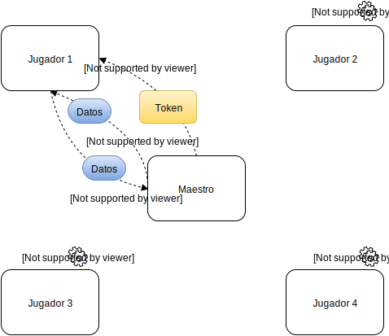
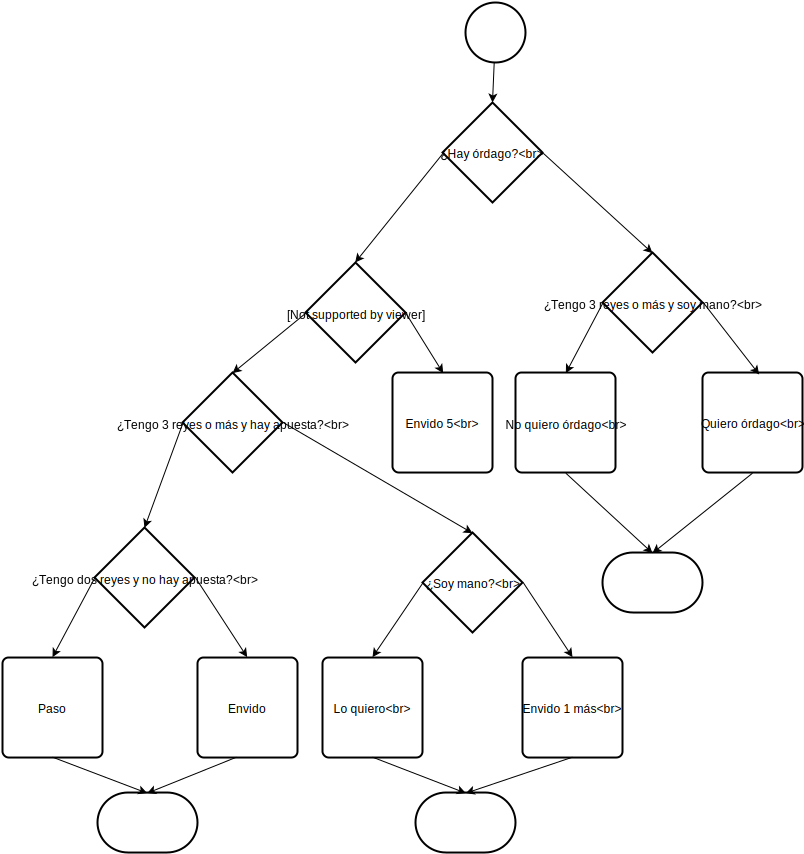

% Asignatura Procesamiento paralelo
% PED 2015-2016: "EL MUS"
% Miguel Expósito Martín - DNI: 72056097H, Tlf. 626509868, e-mail:mexposito37@alumnos.uned.es,  Calle El Campizo 10, 2ºA, CP 39012 Santander (Cantabria)

\pagebreak

# Introducción

La presente práctica se ha desarrollado para las convocatorias de Febrero y Septiembre. La versión de Febrero resultó inutilizable debido a la existencia de interbloqueos y problemas con punteros. Dichos problemas no fueron detectados debido al cambio de versiones de OpenMIP y las utilidades de C entre la plataforma de desarrollo y la máquina virtual proporcionada por los tutores de la asignatura. El trabajo desarrollado no se probó lo suficiente.
 
 Para la versión de Septiembre, se ha optado por lo siguiente:
 
 - Refactorización completa del código, aprovechando tan sólo los módulos reutilizables.
 - Implementación de una arquitectura de la solución mejorada basada en tokens.
 - Implementación de procesos batch para ejecutar trabajos con miles de partidas.
 - Prueba simultánea en el entorno de desarrollo y en la máquina virtual proporcionada por los tutores de la asignatura.
 - Simplificación de las estructuras de datos y funciones para usar enteros, fundamentalmente (reduciendo el uso de caractéres a lo mínimo imprescindible).

# Entorno de desarrollo

Para agilizar el desarrollo se optó por utilizar un IDE potente con funcionalidades avanzadas tales como guardado automático, construcción y ejecución, resaltado de sintaxis, comprobación previa a la compilación, etc.
Conociendo la fama de otros entornos de la compañía [Jetbrains](https://www.jetbrains.com/), se optó por usar [CLion 2016.1.3](https://www.jetbrains.com/clion/) con licencia de estudiante.

Este entorno no podía ser instalado en la máquina virtual proporcionada por los tutores debido a incompatibilidades de la arquitectura de la plataforma. Por ello, el desarrollo se ha llevado a cabo en este entorno en una máquina de 64 bits con Debian Wheezy, mientras que las pruebas se han realizado en la máquina virtual de la asignatura.

# Entregables

- Memoria en formato Markdown (md)
- Memoria en formato PDF
- Código fuente del programa y archivos de configuración para su compilación y construcción
- Programas compilado y linkado con ejecutable: `juego` y `jugador`

# Estructura y compilación del programa

El programa está dividido en los siguientes archivos:

- `juego.c`: código del proceso maestro.
- `jugador.c`: código de cada uno de los procesos jugadores o workers.
- `mus.h`: cabeceras de funciones auxiliares y utilidades necesarias para la lógica del juego.
- `mus.c`: implementación de las funciones descritas en el archivo anterior.
- `CMakeLists.txt`: configuración de CMake para la compilación del programa.
- `compile.sh` script para compilar el código utilizando mpicc.

Para compilar y construir el programa, es posible utilizar tanto la herramienta [CMake](https://cmake.org/) como seguir el procedimiento habitual con `mpicc`. Debido a posibles problemas de versionado, se recomienda esta última alternativa. No se incluirá en la memoria de la práctica documentación relativa a la primera alternativa. 

## Compilación

        mpicc -g -o ./juego juego.c mus.c
        mpicc -g -o ./jugador jugador.c mus.c

## Ejecución

        mpirun -n 1 ./juego
        
**Es muy importante utilizar `mpirun` para ejecutar el programa, ya que proporciona un entorno de ejecución que evita errores de sincronización y comunicación de MPI.** 

\pagebreak

# Memoria descriptiva

## Arquitectura de la solución

Se opta por una arquitectura de procesos maestro - esclavos, con el siguiente funcionamiento:

- El proceso maestro envía un token al jugador al que le toca el turno.
- El jugador recibe el token, y en función de su valor, espera o realiza operaciones.
- Una vez realizadas esas operaciones, se las comunica al maestro si es necesario.
- Mientras tanto, el resto de los jugadores esperan.
- Determinados valores de token hacen que el flujo de programa en el que se encuentran los jugadores en ese momento termine.

A continuación se incluye, grosso modo, el reparto de responsabilidades.

### Proceso maestro

- Inicialización del juego y entorno (mazo, jugadores, etc.)
- Creación de los procesos jugadores
- Selección aleatoria de jugador a dar el corte
- Intercambio de información entre jugadores
- Coordinación de turnos de jugadores
- Gestión de la entrada y salida estándar
- Cálculo de puntuaciones y jugadas

### Procesos jugadores

- Reparto de cartas según las reglas del mus
- Recepción de cartas en la mano de cada jugador
- Evaluación de la mano de cada jugador
- Lógica de mus corrido
- Lógica de descartes
- Lógica de envites

## Estructura de la solución

Tanto en `juego.c` como en `jugador.c` pueden distinguirse los siguientes bloques generales de código:

1. Mus corrido / mus
2. Descartes
3. Lances
4. Envites
5. Conteos y salida por pantalla

## Desarrollo de la práctica

### Lógica inicial

En primer lugar, se implementó la lógica de creación de procesos jugadores (en total, cuatro) a partir del proceso maestro utilizando la primitiva `MPI_Comm_spawn`. También se definieron dos intercomunicadores:

- `parent`: para la comunicación de los jugadores con el maestro.
- `juego_comm`: para la comunicación del maestro con los jugadores.

Las primeras decisiones de diseño se orientaron a las estructuras de datos para almacenar las cartas, el mazo o baraja y las manos. Para todo ello, se definió la siguiente estructura:

       struct carta {
       
           int cara;
           int palo;
           int id;
           int orden;
           int estado; // 0: en mazo, 1: en mano, 2: descartada
       };
       /* fin struct carta */
       typedef struct carta Carta;

Inmediatamente se codificaron las funciones para crear un mazo, imprimirlo por pantalla, barajarlo (aleatoriamente) y cortarlo.

Las constantes (nombres de cartas, lances, palos, valores de cartas, etc.) se definen una sóla vez en la biblioteca `mus.c` y se importan con `extern` en el resto de módulos. En esta biblioteca también están definidas funciones auxiliares como encontrar el máximo de un array, contar un número de ocurrencias, determinar a qué pareja pertenece un jugador, etc.

La generación de números aleatorios para el barajado y la elección de jugadores o cartas se llevó a cabo usando la función `srand()` de la biblioteca `time.h`, aplicada a intervalos de números enteros en base al caso concreto (cartas, jugadores...).

### Comunicaciones entre procesos

El envío de los mazos (por ejemplo, entre el maestro y un jugador para repartir o entre dicho jugador y el maestro para actualizar las cartas este último) se empaquetó en funciones usando una llamada `MPI_Send()` y `MPI_Recv()` para cada elemento de la estructura `Carta`. De esta forma, se consiguió evitar la lógica compleja para enviar `structs` del lenguaje C usando MPI, pudiendo enviar tipos de datos sencillos como `arrays` de enteros.

La actualización de parámetros entre todos los jugadores desde el maestro (como por ejemplo, qué jugador reparte o qué jugador es mano), se llevó a cabo utilizando la primitiva `MPI_Bcast()`.

Para enviar masivamente información al maestro desde los jugadores (por ejemplo, los conteos de cartas para los cálculos de jugadas) se utilizó la primitiva `MPI_Gather` con envíos constantes de N datos, descartando los N últimos por pertenecer al proceso maestro, que no juega.

### Lógica del juego

En primer lugar, se introduce por teclado el modo de juego y la duración de las partidas. En caso de elegirse el modo interactivo, el número de jugador humano se elige aleatoriamente. El jugador humano no tendrá que intervenir en tareas como el reparto de cartas, pero sí en decidir si quiere o no quiere mus, qué cartas se descarta o cuáles son sus envites.

Para simplificar las pruebas, se ofrece la opción de utilizar una configuración por defecto de tres vacas por partida, tres juegos por vaca y cuarenta puntos al juego (la más habitual). En caso contrario, se limitan los valores a los más comunes según los distintos reglamentos (fuente: [Wikipedia](https://es.wikipedia.org/wiki/Mus)): tres o cinco vacas, tres o cinco juegos, treinta o cuarenta puntos.

Para iniciar el juego, se selecciona aleatoriamente un jugador para cortar la baraja. Según el palo que salga en el corte, se elige el jugador repartidor: 

- Oros: el de su derecha.
- Copas: el de "en frente".
- Espadas: el de su izquierda.
- Bastos: él mismo.

Una vez repartidas las cartas, se inicia el mus corrido. La lógica para cortar el mus es la siguiente:

- Si el jugador tiene 31 en juego.
- Si el jugador tiene duples o medias.
- Si el jugador tiene pares y juego "decente", aunque no sea 31. Se entiende como juego "decente" a efectos de esta práctica una puntuación de 31, 32 o 40. 

De esta forma se intenta maximizar que el jugador gane a pares y juego. 

Si no hay mus, se produce la fase de descartes. La lógica de decisiones para descartar es muy simple: se descartan todas las cartas que no sean "chones" (reyes o treses). El objetivo de esta estrategia es intentar conseguir más reyes para poder tener jugada a grande y pares. El jugador repartidor reparte la siguiente carta del mazo hasta que se queda sin cartas; en ese caso, recupera todas las descartadas, las barajea y sigue repartiendo.

Una vez terminados los descartes y roto el mus, tiene lugar la fase de envites. La lógica de decisión para los envites es compleja. Depende de las cartas de cada jugador, de los envites que haya sobre la mesa, de las piedras que lleve ganadas la pareja contraria y de si el jugador pertenece o no a la pareja mano. A continuación se incluye un diagrama de flujo detallando el envite a grande:

Básicamente, primero se comprueba si se dan las condiciones para lanzar un órdago (por ejemplo, que la pareja contraria lleve más de 30 piedras ganadas en el juego actual). En tal caso, se lanza. Si no, dependiendo del lance, se comprueba si se tienen buenas cartas. En función de ello y de si hay envites sobre la mesa o no, se envida, se acepta o se envida más. Para ello también se tiene en cuenta si se pertenece a la pareja mano o no.

Por "buenas cartas" en esta práctica se entiende:

- A grande: 3 reyes o más.
- A chica: 3 ases o más.
- A pares: duples de reyes, duples, medias de reyes.
- A juego: 31 ó 32.
- Al punto: más de 27.

En general, la lógica de envites presenta matices conservadores, si bien en función del desarrollo del juego las apuestas se vuelven más agresivas. Los envites y conteos de cartas son enviados al maestro, que se encarga de calcular los ganadores en cada lance y apuntar las piedras. 

### Desarrollo de la práctica

Se siguieron las fases descritas en el enunciado de la siguiente forma:

- Implementación de lances sin tener en cuenta mus corrido y descartes en modo automático.
- Implementación de fase de descarte (mus corrido y mus) en modo automático.
- Implementación de envites no deterministas en modo automático.
- Inclusión de lógica para interactividad con el jugador humano.
- Iteración de las vacas, juegos y rondas.

### Funcionalidades implementadas

#### Decidir la duración de la partida

Vacas, juegos, puntuación para ganar el juego. Entrada manual y valores por defecto de 3 juegos por vaca y 3 vacas por partida. Después de consultar los distintos reglamentos de mus, sólo se da la opción de decidir entre los valores 3 y 5.

#### Mus corrido
 
Se realiza en la primera ronda de cada vaca. El repartidor se decide a través de corte de baraja. El mazo y la mano van cambiando al jugador de la derecha si nadie corta mus. Se permite hacer descartes.
 
#### Mus normal

Se lleva a cabo en el resto de rondas. En este caso, la mano no cambia (va cambiando al jugador de la derecha con cada ronda jugada).

#### Lance de grande

Se implementan los módulos que calculan los ganadores en base a comparaciones de conteos de todas las manos.  

#### Lance de chica

Ídem que a grande pero cambiando los valores de las cartas.

#### Lance de pares

Se indica si se tienen pares antes de iniciar el lance. Se comprueba que al menos un miembro de cada pareja los tiene antes de jugar. La lógica de cálculo de la mano ganadora es similar a las de grande y chica, pero comparando esta vez jugadas de parejas (duples, medias, pares, etc.). Si ningún jugador tiene pares, nadie se lleva piedras. Si sólo tiene pares una pareja, esta se llevará una piedra de pares en el conteo. Si un jugador no tiene pares, no habla.

#### Lance de juego

Se indica si se tienen pares antes de iniciar el lance. Se comprueba que al menos un miembro de cada pareja los tiene antes de jugar. Si ningún jugador tiene juego, se juega al punto. Si sólo tiene juego una pareja, esta se llevará una piedra de juego en el conteo. Si un jugador no tiene juego y se juega a juego, este no habla.

#### Tanteo de cada ronda

Se lleva a cabo al final de la misma, tras el lance de juego. Si algun lamce ha quedado en paso, la mejor mano se lleva una piedra. Cada 5 piedras, se tiene un amarraco; esto se muestra en el conteo de cada ronda.

#### Envites

Se llevan a cabo según la lógica descrita anteriormente en este documento. Si un envite no es aceptado, la pareja del envite se lleva una piedra inmediatamente. Si lo que no se acepta es un envite a más piedras, entonces la pareja del envite se lleva lo envidado por la pareja anterior.

#### Órdago

El órdago se lanza si:

- La pareja contraria tiene más de 30 puntos.
- Aleatoriamente con un porcentaje muy bajo de ocurrencia. 

#### Otras funcionalidades

- Una vez finalizada la ronda, se recogen las cartas, se cambia el jugador mano, se vuelven a repartir y se comienza nueva ronda.
- La baraja deberá ser custodiada por el proceso que represente al jugador  postre, que es quien reparte. El resto de procesos únicamente conocerán las cartas de su mano. 
- Uso de Reglamento de Naipes Fournier (treses cuentan como reyes y doses como ases).
- No se acepta la jugada "Real".
- Se implementa el modo automático.
- Se implementa el modo interactivo, permitiendo que un jugador humano juegue.
- No se aplican mus visto ni mus revuelto.
- No se implementan jugadas especiales.
- No se implementan señas.
- Desarrollo de interfaz gráfico: se implementan colores en la salida de la consola: azul (informativo), amarillo (hablan jugadores), magenta (habla maestro), rojo (importante), etc.
- Modo de depuración: se ha incluido en los fuentes del maestro y jugadores un mecanismo de anotaciones de depuración que puede activarse o desactivarse cambiando el valor de la directiva `#define DEBUG 0` (1 activo, 0 inactivo).

# Conclusiones

Las **dificultades encontradas** para el desarrollo de la práctica han sido realmente reseñables. Partiendo de la falta de costumbre y práctica de desarrollar en C (el autor de esta memoria hace más de diez años que no lo usa) y de la novedad de la materia de MPI, se citan las siguientes:

- Puesta en marcha de un entorno de desarrollo en C que permitiese agilizar la programación incluyendo avisos y resaltado de errores sin necesidad de compilación.
- **Sincronización entre procesos: sin duda la parte con mayor dificultad de la práctica**, debido a la necesidad de pensar como 5 programas en uno. En muchos casos los procesos quedaban bloqueados y, pese a la separación de la lógica en jugadores y maestro, es difícil superponer mentalmente la lógica de cada jugador en un mismo código. Igualmente, la dificultad de la depuración se multiplica por el número de procesos existentes.
- Dificultad de depuración en C: en muchos casos errores debido a un tamaño de buffer incorrecto por descuido o una errata de intercambiar un paréntesis con un signo igual pasaban desapercibidos provocando comportamientos inesperados y errores de segmentación, siendo realmente difíciles de corregir.
- Dificultad del lenguaje de programación C: al tratarse de un lenguaje de bajo nivel muy tipado, cualquier tarea sencilla requiere de la programación de una función específica (por ejemplo, invertir un `array` o calcular su máximo). Esto hace que el número de líneas del código crezca y posteriormente sea realmente complejo navegar entre ellas.
- Dificultad del juego del mus: para los que, como el autor de esta práctica, nunca hemos jugado al mus, la comprensión y asimilación de sus reglas supone un esfuerzo adicional bastante notable.
- Problemas con la E/S: se han dado problemas tanto con la entrada como con la salida de datos por pantalla, siendo muy útiles en este caso los foros de la asignatura para su resolución.
- Fallos de concepto básicos, como suponer que para ejecutar los programas bastaba con haberlos compilado con `mpicc` sin utilizar `mpirun` para su ejecución.

Como posibles mejoras se proponen las siguientes:

- Mejora de la lógica de decisión (órdagos, mus corrido, envites, etc.) incluyendo más jugadas.
- Tratamiento de errores de E/S.
- Corrección de posibles bugs.
- Las propuestas en el enunciado de la práctica.

Por último, en la opinión de este alumno, el peso global de esta práctica en el cómputo de nota la asignatura debería ser mayor (en base a la percepción subjetiva de tiempo invertido para su realización). 
